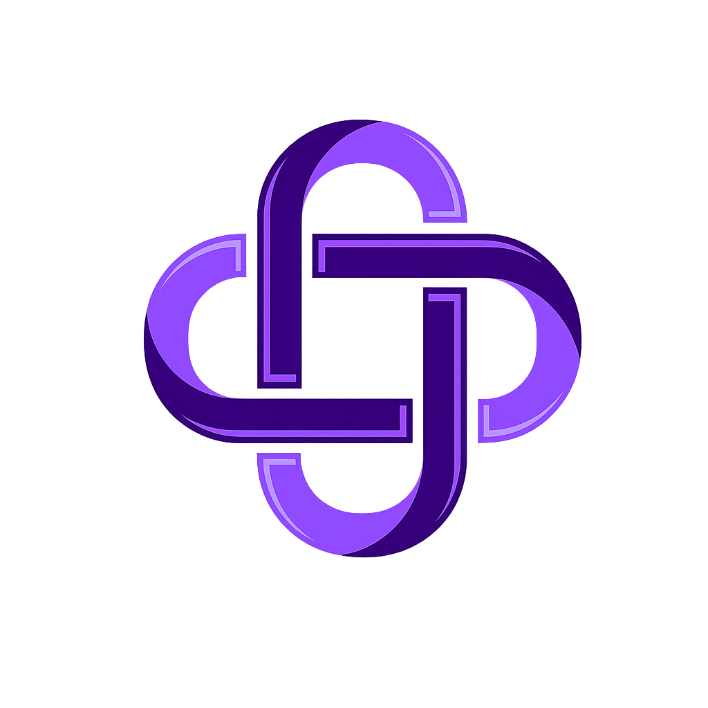
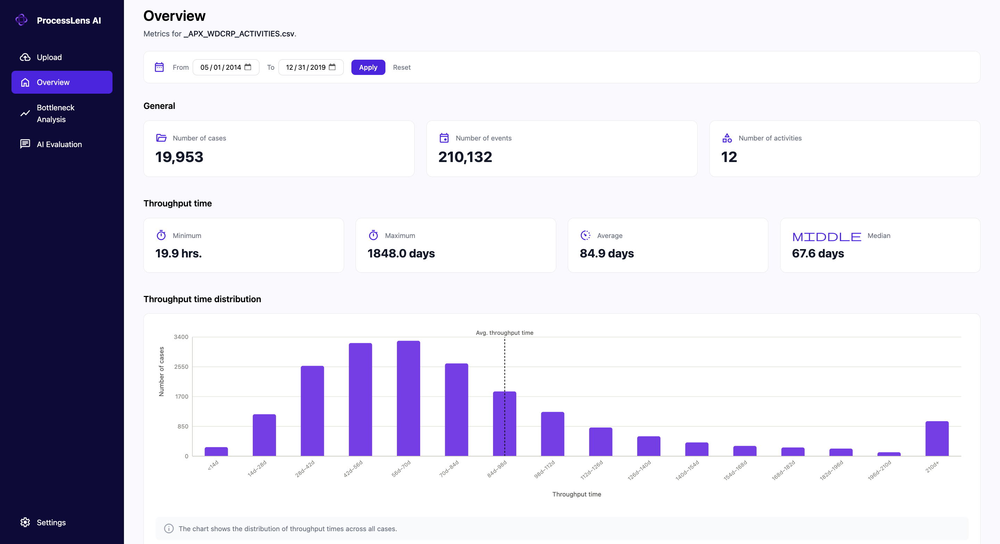

  

<h1 align="center">ProcessLens AI</h1>

  <strong>From Event Logs to Process Insights.</strong>

  A web-based process mining prototype for exploring event logs,
  detecting bottlenecks, comparing process variants and generating
  AI-assisted insights.

  
  
  
  
  

  

